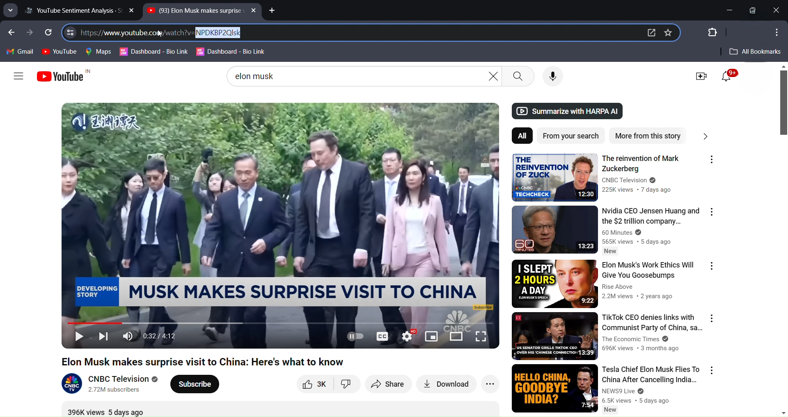
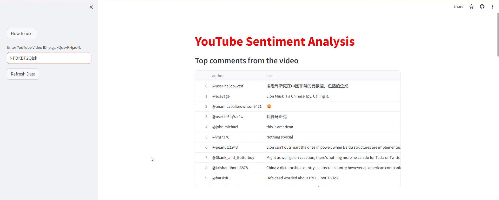
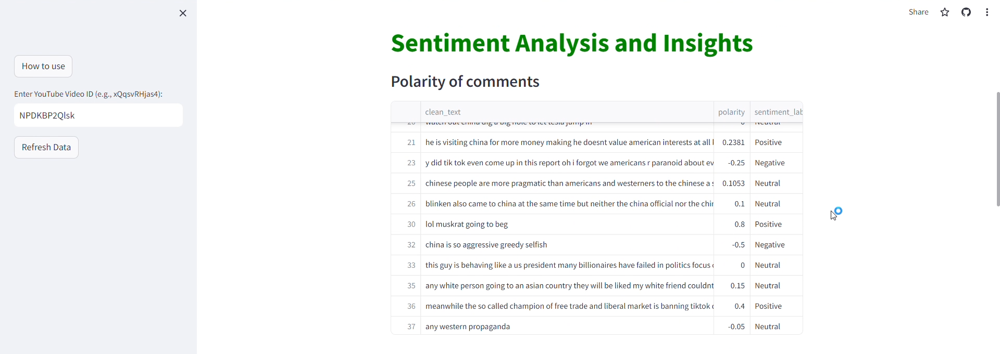
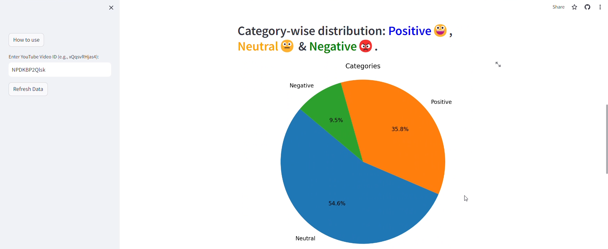
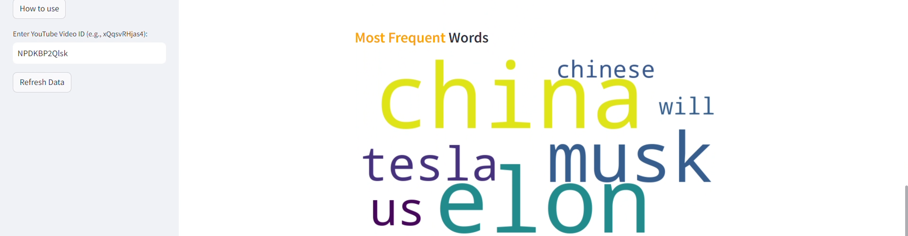
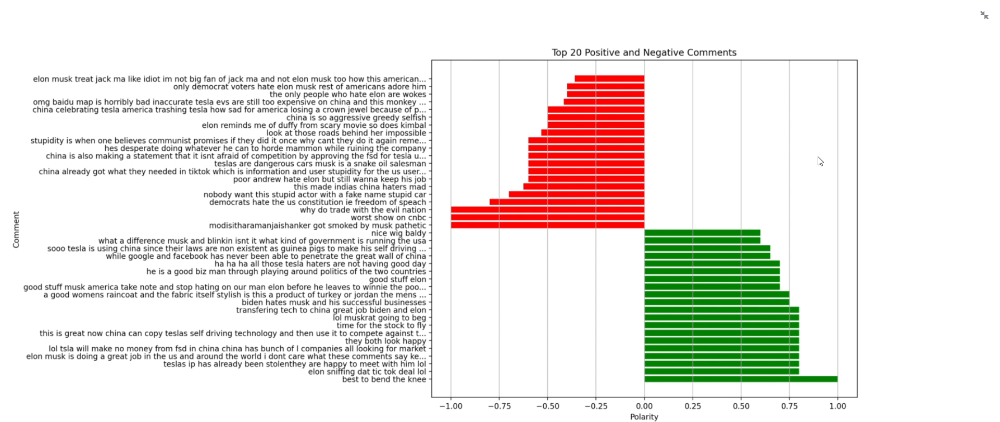

# YouTube Comments Sentiment Analysis Tool for Videos and Shorts

YouTubeSenti is a tool designed to analyze the sentiment of comments on YouTube videos and shorts. It fetches comments from specified videos and conducts sentiment analysis, providing valuable insights into sentiment distribution and highlighting frequently used words. This tool benefits both users and content creators by enhancing their understanding of audience feedback.

## Features

- Effortlessly retrieve comments from any YouTube video by entering the video ID, enabling seamless access to viewer feedback.
- Gain insights into audience engagement by analyzing comment sentiment, helping you understand viewer reactions.
- Visualize overall audience sentiment through intuitive pie charts for quick comprehension.
- Highlight key themes and sentiments with dynamic word clouds showcasing popular words used by viewers.
- Access the most impactful positive and negative comments for immediate insights into viewer preferences.

## Screenshots

Below are screenshots showcasing the functionality and features of the application:

*YouTube Video Under Analysis*

*Fetching Comments from a YouTube Video*

*Sentiment Distribution Visualization*

*Sentiment Distribution Overview*

*Word Cloud of Popular Words*

*Top Positive and Negative Comments*

## Installation

1. Clone the repository:

   git clone https://github.com/SamFusedBits/YoutubeSenti.git

2. Install the required Python packages:
   
   pip install -r requirements.txt

## Usage

1. Run the Streamlit app:
   
        streamlit run app.py

2. Enter the YouTube Video ID in the provided text box.

3. Click the "Enter" button to retrieve comments and analyze sentiment.

## Live Demo

You can access the application at the following link: [YouTubeSenti Live Demo](https://youtubesenti.streamlit.app)
  
## Contributing

Contributions are welcome! If you find any bugs or have suggestions for improvements, please open an issue or submit a pull request.

## License

[MIT License](LICENSE)
